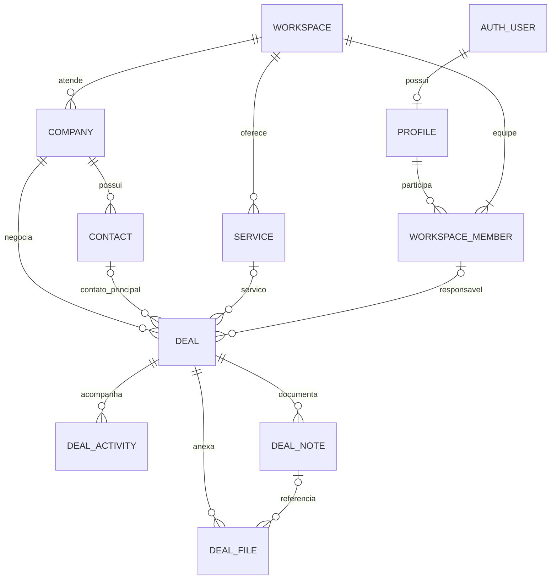

# Diagnóstico do projeto e sequência de organização

> Atualização em 15/09/2026: o financeiro avançou para implementação com dados reais após esta auditoria. Consulte [estado e homologação do financeiro](finance-implementation.md). Os achados abaixo retratam a data original da revisão.

Data: 14/09/2026. Revisão do código próprio em `src`, configuração do projeto, documentação, migrations e estado do Supabase online. Não é uma auditoria dos fontes de todas as dependências de terceiros.

## Direção vigente

A prioridade definida pelo usuário é organizar a casa antes de ampliar funcionalidades: administração, CRM e financeiro. Prospects, busca e automações serão a última etapa. O usuário executa npm, instalações, lint, build e servidores; o agente analisa e escreve arquivos e usa o Supabase online.

A base técnica é aproveitável e não exige recomeçar. O principal problema é a diferença entre a aparência de produto e o estado real das funcionalidades. O banco e o acesso por empresa estão mais avançados que as telas comerciais. É necessário consolidar os cadastros e regras antes de seguir adicionando abas ou indicadores.

## Inventário do que existe

| Área | Banco | Interface / código | Avaliação |
| --- | --- | --- | --- |
| Autenticação pessoal | Supabase Auth e profiles | Cadastro, login, logout, recuperação, callback e tratamento de erro | Login funcional, confirmado pelo usuário; entrega completa de e-mails e recuperação precisam de validação específica |
| Empresa assinante | workspaces | Onboarding, escolha de empresa e alteração de nome | Funcional, mas cadastro administrativo mínimo |
| Equipe | workspace_members, workspace_invites | Convites por link, aceitação, revogação, papéis e remoção | Funcional; não há envio automático de convites |
| Administração da plataforma Lume | private.platform_admins | Nenhum painel | Somente reserva de estrutura privada; não existe gestão de assinantes/planos |
| Empresas atendidas | companies | Mocks e nova ação de criação ainda sem formulário conectado | Cadastro completo pendente |
| Contatos | contacts, com company_id e workspace_id | Ação de criação em andamento; seletores e telas pendentes | Relação correta, experiência de cadastro incompleta |
| Serviços | services | Rota /servicos é placeholder; ação nova não ligada à interface | Catálogo ainda não utilizável |
| Negócios | deals, deal_history | Pipeline, lista, previsão, drawer e criação usam mocks | Protótipo comercial; alterações não persistem pela tela atual |
| Atividades | deal_activities | Ações de inclusão/edição/conclusão escritas; aba ainda vazia | Implementação parcial |
| Notas | deal_notes | Ações de criação/edição/exclusão escritas; aba ainda vazia | Implementação parcial |
| Arquivos | deal_files e bucket privado crm-files | Fluxo de upload em camada de dados e endpoint de acesso escritos; interface pendente | Implementação parcial, sem teste de transferência real |
| Financeiro | Nenhuma tabela financeira | /financeiro é placeholder | Não implementado |
| Agenda | Atividades do CRM podem servir de origem futura | /agenda é placeholder | Não implementada |
| Configurações gerais | Somente campos mínimos de workspace/perfil | /configuracoes é placeholder; /equipe existe separadamente | Incompleto |
| Dashboard | Sem consultas de indicadores reais | Dados, nome e data fixos; orientado a prospects | Demonstração, precisa ser reposicionado |
| Prospects, busca e favoritos | Estruturas legadas de qualificação | Busca filtra mocks; favoritos em memória; detalhes demonstrativos | Preservar, mas não desenvolver agora |

No momento da consulta, o banco tinha uma empresa assinante e um membro. Não havia negócios, notas ou arquivos comerciais cadastrados. Isso confirma que os cartões visíveis do CRM são exemplos, não registros comerciais da empresa.

## O que está no caminho correto

- Separação entre `workspaces` (quem usa/assina o sistema) e `companies` (empresas atendidas no CRM).
- Uma conta pessoal pode pertencer a várias empresas por `workspace_members`.
- Chaves estrangeiras compostas impedem relacionar contato, serviço, responsável e negócio entre empresas diferentes. O contato do negócio também precisa pertencer à empresa atendida selecionada.
- RLS habilitada nas tabelas públicas consultadas, com autorização pela associação vigente e status ativo da empresa.
- Sessão verificada no servidor; empresa ativa no cookie não é usada como autorização suficiente.
- Segredos de service role não foram encontrados no código frontend pesquisado. Clientes utilizam a chave publicável.
- Etapa comercial separada de situação aberto/ganho/perdido, com motivo obrigatório na perda.
- Histórico de negócios no banco, autoria atribuída por trigger e campos de versão para lidar com edições simultâneas.
- Mocks estão em diretórios próprios. O trabalho necessário é impedir que a tela operacional continue consumindo esses mocks.
- Arquivos privados, limite de 10 MB e vínculo relacional com negócio/nota. Upload e download não precisam de bucket público.

## Achados que precisam ser tratados

### P1 — A interface do CRM ainda não grava o negócio

`src/app/(app)/crm/page.tsx` renderiza `CrmWorkspace`, que inicializa `useState(crmDeals)` em `src/features/crm/components/crm-workspace.tsx:30`. Criar, mover ou concluir a atividade altera somente o estado do navegador.

`src/features/crm/actions.ts` e `src/features/crm/data/repository.ts` foram escritos na tarefa em andamento, mas não são chamados pelos componentes do pipeline. Ter tabelas e ações prontas não significa que o CRM esteja integrado.

Conclusão exigida: criar um registro real, recarregar a página, editar, consultar de novo e verificar no banco; repetir com outra empresa para validar o isolamento.

### P1 — Cadastros administrativos ainda não sustentam o fluxo

Não existem telas completas para manter empresas atendidas, contatos e serviços. A empresa assinante contém apenas nome, proprietário e status, além de identificadores/datas. A tela de configurações não administra preferências e não há tela de edição do perfil pessoal.

Começar pelo cadastro mestre evita nomes livres e duplicados em negócio, cobrança e contato. As ações novas de criação rápida do CRM não substituem listagem, edição, inativação, busca e regras de duplicidade desses cadastros.

### P1 — Datas e campos do protótipo não aceitam o modelo real com segurança

`src/features/crm/utils.ts:4` fixa o relógio em 13/09/2026. `formatDate` e `daysInStage` concatenam horário ao texto recebido. Um timestamp ISO completo de `stage_entered_at` pode produzir uma data inválida; a ausência de fechamento, permitida no banco/camada de escrita, pode causar erro de formatação.

O formulário atribui João Silva, score 70 e datas fixas; filtros também têm responsáveis e mês fixos. Valores monetários são exibidos sem centavos. Esses pontos devem ser corrigidos antes da integração real e não devem ser reutilizados no financeiro.

### P1 — Financeiro precisa de domínio e regras próprios

`src/app/(app)/financeiro/page.tsx` contém apenas `PagePlaceholder`. Não existem contas a pagar/receber, contas financeiras, categorias, parcelas, baixas, estornos, saldos ou conciliação no banco.

A previsão ponderada do pipeline é uma estimativa comercial. Não deve alimentar saldo, recebido ou pago como se fosse movimentação de dinheiro. Um negócio ganho pode originar títulos a receber, mas precisa de valor, vencimentos, condição de pagamento e proteção contra geração duplicada. A baixa é um evento separado do fechamento comercial.

### P1 — Separar administração do assinante da administração da Lume

Owner/admin/member são papéis dentro de uma empresa assinante. Não tornam a pessoa administradora da plataforma. `private.platform_admins` não concede acesso implícito ao CRM e não possui painel.

Caso o produto tenha gestão da própria Lume, assinantes, planos, limites e cobranças de assinatura devem ficar em área própria. O financeiro interno da empresa usuária também deve permanecer separado da cobrança da assinatura do software. A prioridade entre essas duas áreas depende da definição de escopo do usuário.

### P2 — O carregamento novo ainda busca tudo

`allRows` em `src/features/crm/data/repository.ts:26` percorre páginas de 500 até trazer todos os registros. `loadCrm` carrega todos os negócios, cadastros auxiliares e atividades pendentes; o detalhe repete a leitura de cadastros.

Isso evita truncamento silencioso inicial, mas não é paginação de produto. Antes de uso com volume: filtros e paginação no servidor, busca de opções sob demanda e carregamento das abas somente quando necessário. Não há benchmark de capacidade nesta revisão.

### P2 — Modelos e componentes duplicados

Existem `crm-pipeline.tsx`/`mocks/deals.ts` com quatro etapas e IDs numéricos e o pipeline atual com cinco etapas e IDs string. O componente antigo não é importado pela rota atual. Também há representações diferentes de prospect e contratos visuais que dependem de tipos dos mocks.

Na organização, escolher uma implementação canônica, separar contratos persistidos dos demonstrativos e retirar o legado não utilizado após conferir referências. No modelo persistido, workspace, versão e identificadores necessários não devem ficar opcionais apenas para acomodar os mocks.

### P2 — Controles visuais incompletos

O botão de adicionar negócio dentro da coluna, o menu de mais opções e ações de comunicação não têm fluxo completo. O drawer não tem gerenciamento de foco de diálogo nem navegação de teclado completa. Cartões e linhas clicáveis precisam de alternativa acessível. Há componentes com JSX muito extenso em uma linha, dificultando manutenção.

Tratar esses controles ao conectar cada fluxo, incluindo carregamento, erro, salvamento confirmado e conflito de edição. Não deixar um botão parecer funcional sem ação.

### P2 — Permissões e histórico precisam acompanhar a administração/financeiro

O conjunto atual permite operação comercial aos membros da empresa. Não há matriz específica de acesso financeiro, aprovações, exportação ou cobrança. Não herdar automaticamente as permissões amplas do CRM para dados financeiros.

O histórico existente cobre criação/alteração de negócios e é removido quando o negócio é excluído. Alterações administrativas e futuras baixas financeiras precisam de autoria, data e trilha apropriadas. A transferência de propriedade, a desativação de usuário e a atribuição de negócios antes da remoção merecem fluxo explícito.

### P2 — Arquivos precisam de validação ponta a ponta e política de ciclo de vida

O banco bloqueia a marcação como pronto sem objeto do tamanho esperado. Ainda é necessário verificar envio, download, preview, falha/interrupção, remoção, links expirados e tentativa de acesso por outra empresa pela API real de Storage.

Definir retenção e limpeza de uploads pendentes. Há FKs restritivas para evitar apagar metadados de arquivos por exclusão em cascata; a exclusão de empresa/negócio com arquivos exige um fluxo de limpeza, não um DELETE genérico. Não remover arquivos pelo SQL diretamente no schema de Storage.

### P2 — Configuração de autenticação antes de produção

O login foi confirmado pelo usuário. A correção do callback distingue falha no retorno de expiração. Ainda é preciso validar confirmação e recuperação com e-mail real, URL permitida correta e navegador de destino.

O advisor atual também aponta proteção contra senhas vazadas desabilitada. Isso é uma pendência de configuração do Auth, não evidência de vazamento ocorrido. Nenhuma configuração remota de Auth/SMTP foi alterada nesta revisão.

### Organização corrigida nesta revisão

- README tinha marcadores de conflito de merge e afirmava que nenhuma rota consultava o banco. Foi reescrito para refletir o estado real e a prioridade vigente.
- `.env.example` estava abrangido por `.env*` no gitignore; foi criada a exceção do exemplo vazio, preservando o bloqueio dos arquivos de credenciais.
- A migration online de notas/arquivos foi registrada no projeto com a versão remota `20260914163707` e os tipos do banco foram sincronizados.
- A validação de nome de arquivo teve a mesma regra expressa sem regex de caracteres de controle, evitando incompatibilidade previsível com lint.
- O trabalho funcional novo do CRM foi pausado para esta revisão. Não apresentar as abas ou a persistência como concluídas.

## Modelo de relacionamentos a consolidar

O diagrama resume as entidades existentes. Todos os vínculos comerciais precisam respeitar o workspace. A empresa atendida pode ser cadastrada manualmente; o negócio não deve depender de busca de prospects. Prospecção futura será uma origem de dados/qualificação associada ao cadastro, não um pré-requisito para vender.

Antes do financeiro, definir se a mesma empresa pode ser cliente e fornecedor e como representar esses papéis sem cadastros duplicados. Antes de ampliar serviços por negócio, definir se a operação vende um único serviço ou itens com quantidades e preços; o modelo atual possui um service_id por negócio.

## Sequência de entrega proposta

Atualização posterior à auditoria: a primeira implementação de administração e cadastros foi escrita e aplicada no banco. O estado atual e a homologação pendente estão em [administration-master-records.md](administration-master-records.md). Os achados acima registram a situação anterior a essa implementação; CRM e financeiro continuam pendentes.

| Etapa | Entrega | Critério de conclusão |
| --- | --- | --- |
| 0. Organização | Documentação atual, modelo canônico, remoção do legado sem uso, menu/dashboard coerentes, padrões de formulários, datas e erros | Não há dúvida entre demonstração, dados reais e funcionalidades em desenvolvimento; checks atuais validados pelo usuário |
| 1. Administração | Perfil pessoal, dados da empresa, equipe/permissões e cadastros mestres de empresas atendidas, contatos e serviços | Cadastrar, editar, buscar e inativar; dados sobrevivem ao reload; referências não se rompem; isolamento validado |
| 2. CRM | Conectar pipeline, negócio editável, atividades, notas, arquivos, histórico e ganho/perda | Fluxo comercial completo com dados reais; conflitos de edição, acesso indevido e falhas de upload tratados |
| 3. Financeiro básico | Categorias, contas, clientes/fornecedores, pagar/receber, vencimentos, baixas parciais e estornos | Valores e saldo coerentes, operações transacionais, permissões próprias, histórico e ausência de duplicação |
| 4. Integração comercial/financeira | Origem de títulos em negócio ganho, parcelas/recorrência se necessárias, cancelamentos e indicadores reais | Fechar negócio não equivale a receber; repetir a ação não gera cobrança duplicada; origem rastreável |
| 5. Prospects | Busca, enriquecimento, score, abordagens e conversão para cadastros existentes | Usa a estrutura de empresas/contatos/negócios já consolidada, sem criar clientes duplicados |

O desenho do financeiro começa durante a organização dos cadastros, mas sua implementação vem após um fluxo comercial básico confiável. Integração bancária, emissão fiscal e billing da Lume são escopos separados, não funcionalidades já existentes.

## Evidências e limites da revisão

Revisão estática de código e consultas ao banco online. Não foram executados npm, lint, build, instalação nem servidor nesta revisão. Os checks que passaram na entrega do login não validam automaticamente os arquivos de CRM escritos depois.

O advisor de segurança encontrou RLS sem política em `private.platform_admins` (negação intencional de acesso) e proteção contra senhas vazadas desabilitada. O de performance apontou índices ainda não usados e duas políticas permissivas de leitura de profiles. Índices sem uso são esperados no banco comercial vazio; não foram removidos. As duas políticas de perfil somam acesso próprio e da equipe; a observação não demonstra acesso entre empresas.

O teste `supabase/tests/crm-notes-files.sql` passou online nesta revisão para metadados de notas/arquivos, autoria, versões, FKs, bloqueio de upload incompleto e acesso anônimo. Todos os dados temporários foram desfeitos com ROLLBACK. Ele não substitui upload real via Storage nem testes de interface.

Próxima validação local, executada pelo usuário: `npm run lint` e `npm run build`. Em seguida, conferir os fluxos reais da etapa escolhida. Até esses resultados, a integração nova deve permanecer marcada como em andamento.
